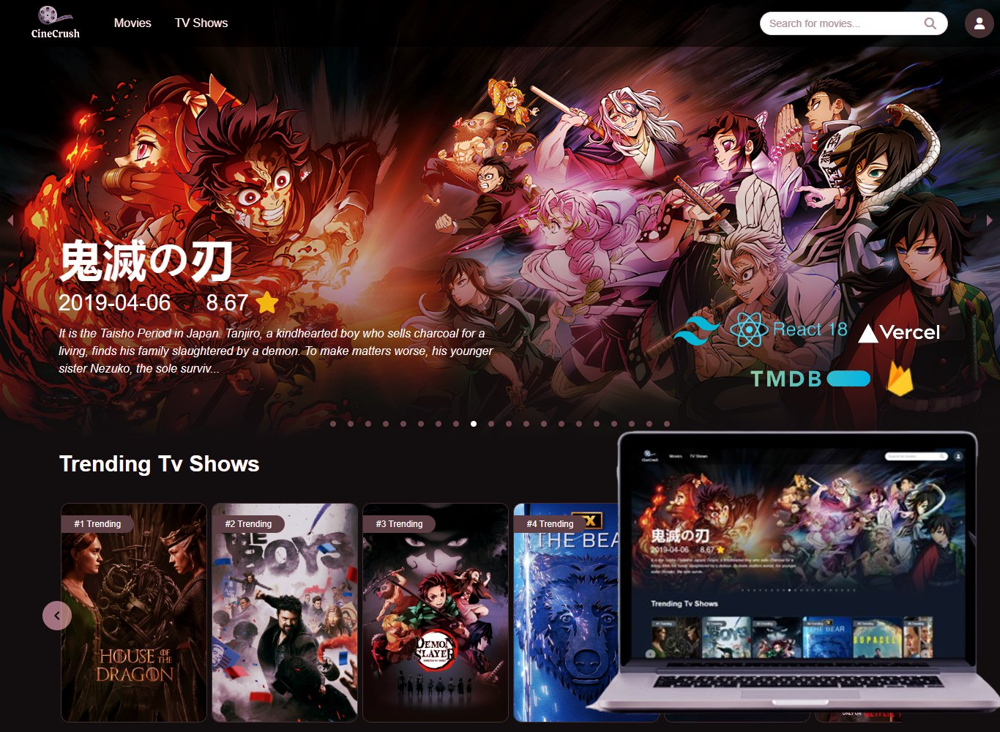
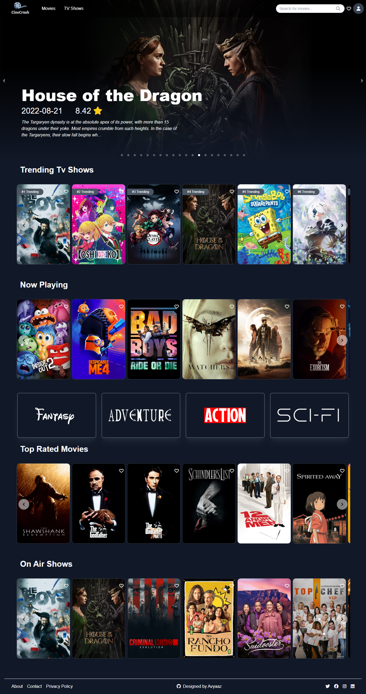

# 🎬 Movie Mania Web Application🍿

Welcome to Movie Mania, your ultimate destination for all movies! This project is built using React, Tailwind CSS, and integrates with the TMDb API for fetching movie data.

## Features

- Browse top-rated movies and TV shows.
- Search for movies and TV shows by title.
- View detailed information about each movie or TV show, including synopsis, cast,  and trailers.
- Google authentication using Firebase for user sign-in.
- Watch trailers directly from YouTube for selected movies.

## Screenshots

### Home Page

### Movie Detail Page

### Search Results Page

## Technologies Used

- React
- Tailwind CSS
- TMDb API
- Firebase Authentication

## Getting Started

To run this project locally, follow these steps:

1. Clone the repository.
2. Install dependencies using `npm install`.
3. Start the development server with `npm run dev`.

## Deployment

This project is deployed on Vercel. You can view it live at [Movie Mania](https://movie-mania-ashy.vercel.app/).

To deploy your own instance, follow these steps:

1. Configure your Vercel account and project settings.
2. Set up environment variables for API keys or other sensitive information.
3. Deploy your project using Vercel's CLI or GitHub integration.

## Contributing

Contributions are welcome! Please open an issue or pull request for any changes or improvements you would like to propose.

## Future Enhancements

- Implement user reviews and ratings for movies.
- Enhance search functionality with autocomplete suggestions.
- Integrate more social login options (e.g., Facebook, Twitter).

